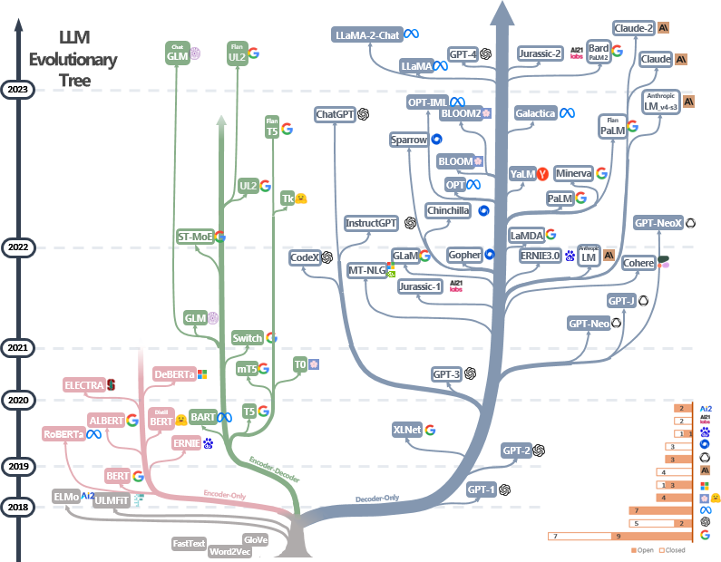
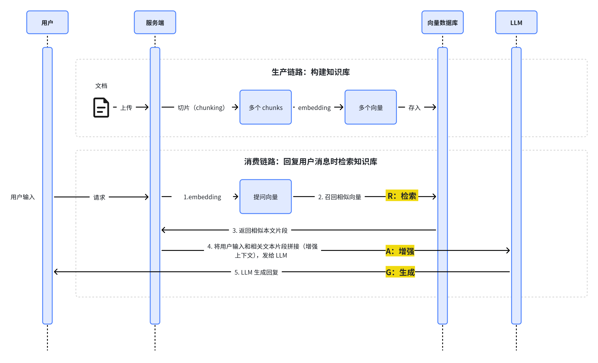
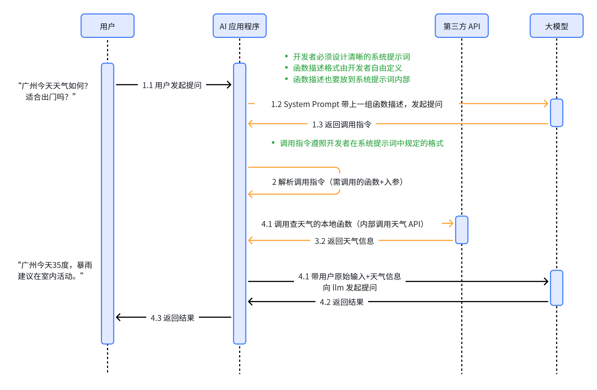
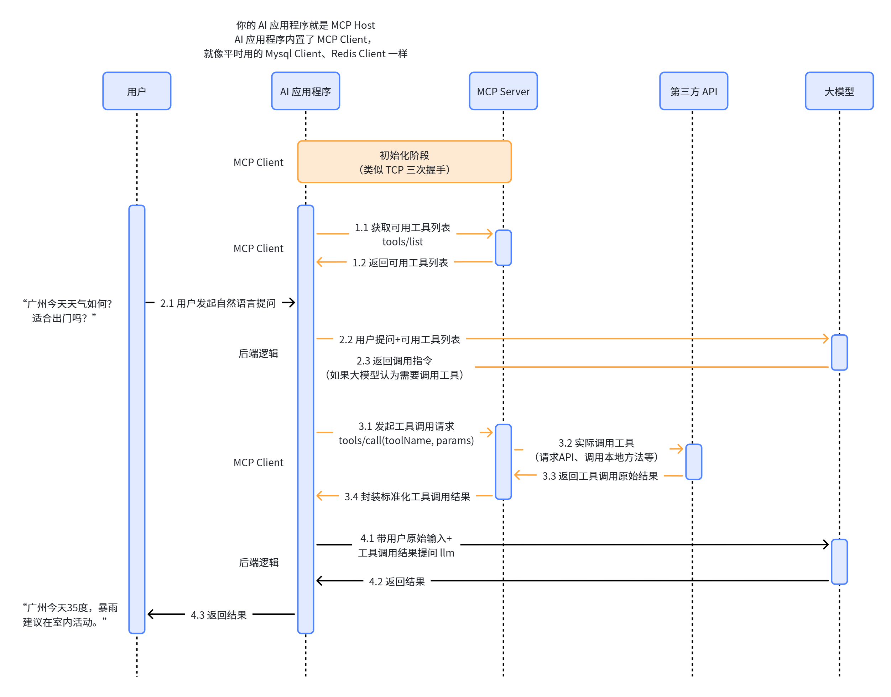

# 正文开始

## LLM
- 论文：[Attention Is All You Need](https://arxiv.org/abs/1706.03762)
- 架构分类：
  - 粉色：Encoder-Only
  - 绿色：Encoder-Decoder（经典架构）
  - 蓝色：Decoder-Only（当前更主流）
  - 

## Prompt Engineering
- 文章链接：[提示词工程笔记](https://www.aneasystone.com/archives/2024/01/prompt-engineering-notes.html)

## Fine-tuning（微调）
- 论文：[LoRA: Low-Rank Adaptation of Large Language Models](https://arxiv.org/abs/2106.09685)

## RAG（检索增强生成）
- 论文：[Retrieval-Augmented Generation for Knowledge-Intensive NLP Tasks](https://arxiv.org/abs/2005.11401)

## Function Call
- 官方指南：[OpenAI Function Calling](https://platform.openai.com/docs/guides/gpt/function-calling)

### Function Call 数据流示意
用户 → AI应用程序 → 第三方API → 大模型

## MCP（Model Context Protocol）
- 文档：[MCP Introduction](https://modelcontextprotocol.info/docs/introduction/)
- 说明：您的AI应用程序就是MCP Host，AI应用程序内置了MCPClient，就像MySQL Client、Redis Client一样。

## Agent
- 论文：[ReAct: Synergizing Reasoning and Acting in Language Models](https://arxiv.org/abs/2210.03629)
- 参考链接：
  - [Twitter 分享](https://x.com/HiTw93/status/2034627967926825175)
  - [中文解读](https://tw93.fun/2026-03-21/agent.html)
- Agent Loop：思考 → 行动 → 观察
- Agent 设计模式：
  - [Overview of AI Agent Workflow Design Patterns](https://medium.com/binome/ai-agent-workflow-design-patterns-an-overview-cf9e1f609696)
  - [微信文章](https://mp.weixin.qq.com/s/7CZ6cHWQ-T9bmaWoJFwdwA)

## Multi-Agent
- 博客：[Building multi-agent systems: when and how to use them](https://claude.com/blog/building-multi-agent-systems-when-and-how-to-use-them)

## Context Engineering
- [LangChain] Context Engineering
- [Effective context engineering for AI agents (Anthropic)](https://www.anthropic.com)
- [微信文章](https://mp.weixin.qq.com/s/KbviOJ6q-K4ik_wzsUs2dw)

## Agent Skill
- [Equipping agents for the real world with Agent Skills (Claude)](https://claude.com/blog/equipping-agents-for-the-real-world-with-agent-skills)
- [官方文档](https://platform.claude.com/docs/en/agents-and-tools/agent-skills/overview)
- [Agent Skills 社区](https://agentskills.io/home)

## OpenClaw
- 精简版实现：[nanobot](https://github.com/HKUDS/nanobot)

## Harness Engineering
- [Harness Engineering (OpenAI)](https://openai.com/zh-Hans-CN/index/harness-engineering/)

## Claude Code 源码分享
- [instructkr/claw-code](https://github.com/instructkr/claw-code)
- [hesreallyhim/claude-code-fork](https://github.com/hesreallyhim/claude-code-fork)
- [YouTube 视频](https://www.youtube.com/watch?v=DXTS82fJO9A)

---

# 技术点代码块（总结）

1. **LLM**  
   Transformer 架构的提出奠定了大模型时代基础，使基于注意力机制的生成模型成为主流。Decoder-Only（仅解码器）的 Transformer 架构变体是当下最为主流的架构。

2. **Prompt Engineering**  
   提示词是用来引导模型按照特定意图生成输出的输入指令，主要包含系统提示词和用户提示词。提示词工程是通过设计和优化提示词，使大模型更准确、可控地产生所需输出，是一种低成本调优手段。

3. **Fine-tuning（微调）**  
   微调是在已有模型基础上，用特定数据再训练，让模型更适合某个具体任务或场景。微调要训练模型的参数，LoRA 算法通过只训练少量低秩参数进行微调，大幅降低了训练成本。

4. **RAG（检索增强生成）**  
   先从外部知识库检索相关信息，再结合这些信息一起生成回答，从而提升模型的准确性和知识时效性。

5. **Function Calling**  
   Function Calling 是让大模型按约定格式输出调用指令，从而由外部系统真正去执行具体操作的一种机制。它让模型从“只会说话”变为“会调用工具”。

6. **MCP（Model Context Protocol）**  
   一种标准化协议，用来让大模型以统一的方式连接外部工具、数据源和服务，从而获取上下文信息并执行操作。MCP 使工具可以跨 AI 应用复用，推动社区生态发展。

7. **Agent**  
   Agent 是一种能够基于目标进行“思考-行动-观察”循环、能够自主调用工具来完成复杂任务的智能系统。Agent 本质上是对人类的模拟。「提示词 + LLM + Tools」就可以构成一个最简单的 Agent。

8. **Multi-Agent**  
   由多个分工协作的 Agent 共同完成任务，通过拆分任务与隔离上下文解决单 Agent 系统难以处理的复杂问题。需谨慎使用以避免 Token 消耗量大、协作效率低、系统复杂度过高等问题。

9. **Context Engineering**  
   Agent 运行中需要提供给 LLM 的一切相关信息（如对话历史、用户输入、背景知识、工具结果等）都是上下文。上下文工程关注如何高质量筛选、压缩和组织上下文，从而最大化模型决策与推理能力。

10. **Agent Skill**  
    Agent Skills 是一种轻量级的开放格式，用于将一整套 Agent 能力（prompt、工具脚本、知识文件等）封装为可复用模块，从而实现低门槛分享与复用。Agent Skill 本质上约等于一个子 Agent，特别适合 SOP 的沉淀和复用。Agent 会在运行过程中按需激活不同 Skills、按需读取和使用 Skills 文件包里的内容（渐进式披露）。

11. **OpenClaw**  
    OpenClaw 是一款开源、高可扩展的 AI Agent 框架，基于 TypeScript 开发，核心用途是构建可自定义的私人 AI 助手。创新之一是拓展了 Agent 的交互入口（如飞书等）。

12. **Harness Engineering**  
    Harness Engineering 强调通过构建受控环境，让 Agent 在约束下高效可靠地完成长周期复杂任务。包含围绕 Agent 构建约束机制、反馈回路、可靠上下文等工程实践。