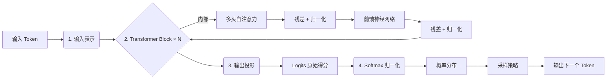

> **摘要**：本文详细拆解了现代大语言模型（LLM）从接收一个输入 Token 到输出下一个 Token 概率分布的完整流程。内容涵盖五个核心阶段，提供**专业术语解释**与**通俗比喻**对照，适合深度学习初学者及从业者参考。

---

## 📌 核心流程概览

---

## 1️⃣ 第一阶段：输入表示 (Input Representation)
**—— 把文字变成计算机能懂的“坐标”**

### 🔬 专业解释
*   **Tokenization (分词)**：将输入文本切分为子词单元（Token）。
*   **Token Embedding (词元嵌入)**：通过查找表将每个 Token 映射为固定维度的向量 $E \in \mathbb{R}^{d_{model}}$。
*   **Positional Embedding (位置嵌入)**：加入位置编码 $P$ 以感知顺序（如正弦编码或可学习编码）。
*   **公式**：
    $$H_0 = \text{Embedding}(token) + \text{PositionEncoding}(index)$$

### 💡 通俗比喻
*   **切积木**：把句子切成“我”、“爱”、“AI”等小积木。
*   **贴身份证**：给每个积木贴上一串代表含义的“数字号码”（向量）。
*   **标序号**：因为计算机不知道顺序，再贴上“第1个”、“第2个”的标签。
*   **合体**：含义号码 + 序号标签 = 最终输入数据包。

---

## 2️⃣ 第二阶段：多头自注意力机制 (Multi-Head Self-Attention)
**—— 让每个词都去“关注”句子里的其他词，理解上下文**

### 🔬 专业解释
*   **线性投影**：生成查询 ($Q$)、键 ($K$)、值 ($V$) 矩阵：$Q=HW_Q, K=HW_K, V=HW_V$。
*   **缩放点积注意力**：
    $$\text{Attention}(Q, K, V) = \text{softmax}\left(\frac{QK^T}{\sqrt{d_k}}\right)V$$
    *   $QK^T$ 计算相关性得分，$\sqrt{d_k}$ 防止梯度消失。
*   **因果掩码 (Causal Mask)**：确保当前位置只能关注之前的位置（防止偷看未来）。
*   **多头机制**：并行执行多组注意力，学习不同维度的关系（语法、指代等），最后拼接投影。

### 💡 通俗比喻
*   **开研讨会**：每个词拿着“查询”去问其他词：“谁是主语？”、“谁修饰谁？”。
*   **互相打分**：匹配度高的词（如“它”和“猫”）获得高关注度，不相关的被忽略。
*   **多组讨论**：同时开好几个小组会，一组研究语法，一组研究语义，最后汇总结论。
*   **防作弊**：当前的词绝对看不到后面还没生成的词。

---

## 3️⃣ 第三阶段：前馈神经网络与前规范化 (FFN & Pre-Norm)
**—— 对信息进行深度加工和非线性变换**

### 🔬 专业解释
*   **残差连接 (Residual Connection)**：$Z = \text{LayerNorm}(H_{input} + \text{AttentionOutput})$，防止深层网络退化。
*   **位置前馈网络 (Position-wise FFN)**：独立处理每个位置的向量，引入非线性。
    $$\text{FFN}(Z) = \max(0, ZW_1 + b_1)W_2 + b_2$$
    *   常用激活函数：ReLU 或 GELU。
*   **再次残差与归一化**：$H_{out} = \text{LayerNorm}(Z + \text{FFN}(Z))$。
*   **架构注记**：现代模型（如 Llama, GPT-3）多采用 **Pre-LN** 结构（先归一化再进入子层）。

### 💡 通俗比喻
*   **保留原意**：把“原来的自己”和“开会学到的新东西”加起来，防止走火入魔（残差连接）。
*   **独立思考**：每个词关起门来深度消化信息，处理复杂的逻辑（如反讽、双重否定）。
*   **标准化**：每次处理完都把数据拉回标准范围，防止数字爆炸或消失，让下一层更好处理。
*   *(注：以上过程会重复堆叠多次，层数越深，理解越深)*

---

## 4️⃣ 第四阶段：输出投影 (Output Projection / Unembedding)
**—— 把高维向量变回词汇表的分数**

### 🔬 专业解释
*   **线性映射**：利用权重矩阵 $W_{out}$ ($d_{model} \times V_{ocab\_size}$) 将最终隐藏状态 $H_{final}$ 映射回词汇表维度。
    $$Logits = H_{final} \times W_{out}^T$$
*   **Logits**：长度为词汇表大小的向量，代表每个词的未归一化得分。
*   **权重共享**：许多模型中 $W_{out}$ 复用输入嵌入矩阵的转置（Weight Tying）。

### 💡 通俗比喻
*   **翻译回人话**：把内部的“高维思想”翻译回字典里的所有单词。
*   **打草稿分**：对着几万个词打分。
    *   “猫”：10分（很高）
    *   “苹果”：3分（一般）
    *   “桌子”：-2分（很低）
*   此时只是原始分数，还不是概率。

---

## 5️⃣ 第五阶段：Softmax 归一化
**—— 把分数变成真正的概率**

### 🔬 专业解释
*   **Softmax 函数**：
    $$P_i = \frac{e^{Logit_i}}{\sum_{j=1}^{V} e^{Logit_j}}$$
*   **作用**：
    1.  **指数化**：放大高分项差异，压低低分项。
    2.  **归一化**：确保 $\sum P_i = 1$。
*   **采样策略**：根据概率分布 $P$ 选择下一个 Token（贪婪搜索、Top-k、Top-p/Nucleus Sampling）。

### 💡 通俗比喻
*   **转化百分比**：把原始分数强行压缩成总和为 100% 的概率。
    *   “猫”：80%
    *   “苹果”：15%
    *   其他：5%
*   **掷骰子决策**：
    *   **严谨模式**：直接选概率最高的（贪婪）。
    *   **创作模式**：按概率掷骰子，偶尔选次优解，增加多样性。

---

## 📝 核心逻辑链条总结

| 步骤 | 关键动作 | 核心目的 | 形象比喻 |
| :--- | :--- | :--- | :--- |
| **1. 输入** | Embedding + Position | 文字数字化 | 贴身份证 + 标序号 |
| **2. 注意力** | Q/K/V + Mask | 理解上下文关系 | 开研讨会，互相打量 |
| **3. 前馈** | FFN + Residual | 深度特征提取 | 独立思考，消化信息 |
| **4. 投影** | Linear Projection | 映射回词汇表 | 给所有候选词打分 |
| **5. 输出** | Softmax + Sample | 生成概率并决策 | 转百分比，掷骰子选人 |

---

> **备注**：本笔记基于 Decoder-only Transformer 架构（如 GPT 系列）整理。实际工程中可能包含更多优化技巧（如 RoPE 旋转位置编码、SwiGLU 激活函数等），但核心逻辑保持一致。